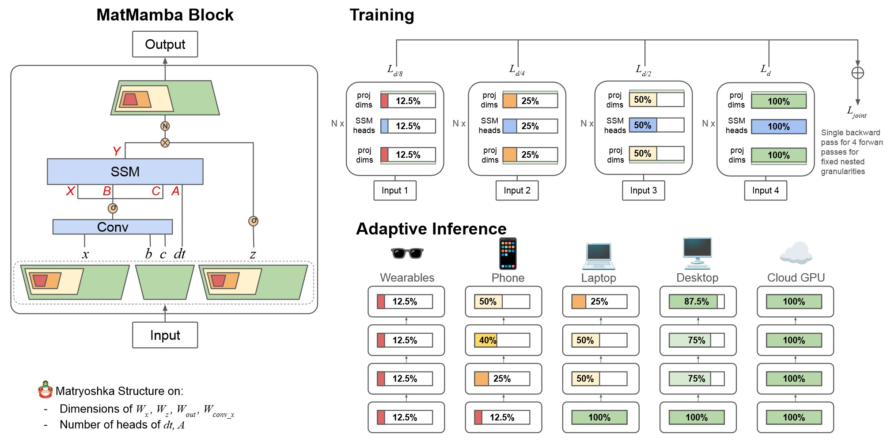
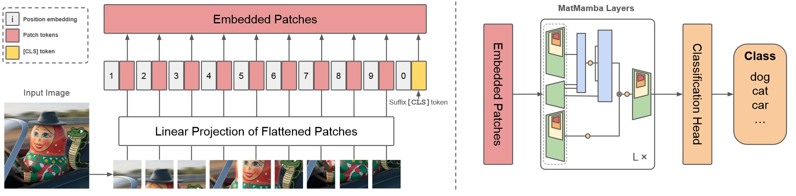

# MatMamba


**MatMamba: A Matryoshka State Space Model**

Abhinav Shukla, Sai Vemprala, Aditya Kusupati, Ashish Kapoor

[https://arxiv.org/abs/2410.06718](https://arxiv.org/abs/2410.06718)

## About
MatMamba is a general sequence processing architecture based on [Mamba2](https://github.com/state-spaces/mamba). It introduces a nested [Matryoshka](https://arxiv.org/abs/2205.13147) structure in a Mamba2 block. We jointly train a few chosen granularities to get a single model from which we can flexibly extract a large number of nested submodels for adaptive inference based on the available deployment compute.

For example, one could train a single 7B model (with the same weights) while explicitly optimizing nested submodels that are 3.5B, 1.75B, and 875M. Then, at inference time we could use a 7B model on a large GPU, an 875M model on a phone, and an interpolated 2.3B model with Mix'N'Match on a medium-sized GPU. We explictly train a few (in this case 4) submodels, but are able to get hundreds of nested submodels for free by Matryoshka style learning.

## Setup
To install the `matmamba` package and set up a fresh conda environment with all necessary dependencies, run the following script:

```bash
bash scripts/setup_env.sh
```

## Usage

Like a Transformer and Mamba2, a MatMamba2 block takes in a tensor of shape `(batch_size, seq_len, d_model)` and returns a tensor of the same shape. Based on the available compute, we can use a specific number of dimensions (and heads) internally.

```python
import torch
from matmamba import MatMamba2

matmamba_block = MatMamba2(
    d_model=512,
    d_state=128,
).cuda()
b, l, d = 8, 1024, 512
x = torch.randn((b, l, d)).cuda()

# Without any optional args/config, the block is a regular Mamba2 block
y1 = matmamba_block(x)
assert y1.shape == (b, l, d)

# If we want a number of dims as a fraction of `d_model`, we can use the `mrl_level` 
# An `mrl_level` of 2 means that `d_model/2` dims will be used
y2 = matmamba_block(x, mrl_level=2)

# `y2` is also (b, l, d), but only half the dims are used internally
assert y2.shape == (b, l, d)

# We can also manually specify the number of dims for each layer using `mixnmatch_dims` 
# For example, if we want to use exactly 64 dims:
matmamba_block.mixnmatch = True
matmamba_block.mixnmatch_dims = 64

y3 = matmamba_block(x)
assert y3.shape == (b, l, d)

# Set mixnmatch to False to revert to the default behavior
matmamba_block.mixnmatch = False
matmamba_block.mixnmatch_dims = matmamba_block.d_model

```

See [`matmamba/mamba2.py`](https://github.com/ScaledFoundations/MatMamba/blob/main/matmamba/mamba2.py) for the implementation of the MatMamba2 block.

## Models
We can make a vision model (MatMamba-Vision) and a language model (MatMamba-LM) using the MatMamba block.

### MatMamba-Vision


This works very similar to a ViT. The transformer blocks are replaced by MatMamba blocks, and the [CLS] token is moved to a suffix due to the causal nature of Mamba2. We can attach a classification head for tasks like image classification on ImageNet, but it can also be used for any vision task.

```python
import torch
from matmamba import MatMamba2Vision, MatMamba2VisionConfig

config = MatMamba2VisionConfig(
    d_model=1024,
    n_layer=20,
    d_intermediate=0,
    n_classes=1000,
    patch_size=16,
    drop_path_rate=0.1,
    proj_drop_rate=0.1,
)
model = MatMamba2Vision(config).cuda()

x = torch.randn((8, 3, 224, 224)).cuda() # Dummy image batch

y = model(x)
assert y.shape == (8, 1000)

# mrl_level and mixnmatch_dims can be used here as well
y2 = model(x, mrl_level=2)
assert y2.shape == (8, 1000)

for layer in model.layers:
    layer.mixer.mixnmatch = True
    layer.mixer.mixnmatch_dims = 256

y3 = model(x)
assert y3.shape == (8, 1000)
```

You can also directly load a pretrained model using the `from_pretrained` method:

```python
model = model.from_pretrained("scaledfoundations/MatMamba-Vision-135M-ImageNet")
```

See [`matmamba/matmamba2_vision.py`](https://github.com/ScaledFoundations/MatMamba/blob/main/matmamba/matmamba2_vision.py) for the implementation of the vision backbone, and training code in [`train_imagenet.py`](https://github.com/ScaledFoundations/MatMamba/blob/main/train_imagenet.py).

#### Data Preparation for ImageNet

[coming soon]

### MatMamba-LM
We can also make a Causal Language Model using the MatMamba block.

```python
import torch
from mamba_ssm.models.config_mamba import MambaConfig
from matmamba import MatMambaLMHeadModel

model = MatMambaLMHeadModel(MambaConfig(n_layer=24, d_model=768)).cuda()

vocab_size = 50280
b, l = 8, 1024
# Dummy input batch of token ids, can come from any tokenizer
x = torch.randint(0, vocab_size, (b, l)).cuda()

y = model(x).logits
assert y.shape == (b, l, vocab_size)

# mrl_level and mixnmatch_dims can be used here as well
y2 = model(x, mrl_level=2).logits
assert y2.shape == (b, l, vocab_size)

for layer in model.backbone.layers:
    layer.mixer.mixnmatch = True
    layer.mixer.mixnmatch_dims = 384

y3 = model(x).logits
assert y3.shape == (b, l, vocab_size)
```

You can also directly load a pretrained model using the `from_pretrained` method:

```python
model = model.from_pretrained("scaledfoundations/MatMamba-LM-1.4B-FineWeb")
```

See [`matmamba/mixer_seq_simple.py`](https://github.com/ScaledFoundations/MatMamba/blob/main/matmamba/mixer_seq_simple.py) for the implementation of the language model backbone, and training code in [`train_fineweb.py`](https://github.com/ScaledFoundations/MatMamba/blob/main/train_fineweb.py).

#### Data Preparation for FineWeb

[coming soon]

## Pretrained Models

You can find all pretrained models (MatMamba-Vision and MatMamba-LM) from the paper on Hugging Face in the [MatMamba collection](https://huggingface.co/collections/scaledfoundations/matmamba-670701480fa415dc2de60453).

| Model Name       | Training Dataset | d_model | Training Granularities | Link to Weights                                                                 |
|------------------|------------------|---------|------------------------|---------------------------------------------------------------------------------|
| `MatMamba-Vision-35M`  | ImageNet         | 512     | 512, 256, 128, 64                | [weights](https://huggingface.co/scaledfoundations/MatMamba-Vision-35M-ImageNet/tree/main) |
| `MatMamba-Vision-135M`  | ImageNet         | 1024     | 1024, 512, 256, 128               | [weights](https://huggingface.co/scaledfoundations/MatMamba-Vision-670M-ImageNet/tree/main) |
| `MatMamba-LM-130M`  | FineWeb         | 768     | 768, 384, 192, 96               | [weights](https://huggingface.co/scaledfoundations/MatMamba-LM-130M-FineWeb/tree/main) |
| `MatMamba-LM-370M`  | FineWeb         | 1024     | 1024, 512, 256, 128               | [weights](https://huggingface.co/scaledfoundations/MatMamba-LM-370M-FineWeb/tree/main) |
| `MatMamba-LM-790M` | FineWeb         | 1536     | 1536, 768, 384, 192               | [weights](https://huggingface.co/scaledfoundations/MatMamba-LM-790M-FineWeb/tree/main) |
| `MatMamba-LM-1.4B` | FineWeb         | 2048     | 2048, 1024, 512, 256               | [weights](https://huggingface.co/scaledfoundations/MatMamba-LM-1.4B-FineWeb/tree/main) |

## Citation

If you use this code, or otherwise find our work valuable, please cite:

```
@article{shukla2024matmamba,
    title={MatMamba: A Matryoshka State Space Model},
    author={Shukla, Abhinav and Vemprala, Sai, and Kusupati, Aditya, and Kapoor, Ashish},
    journal={arXiv preprint arXiv:2410.06718},
    year={2024}
}
```